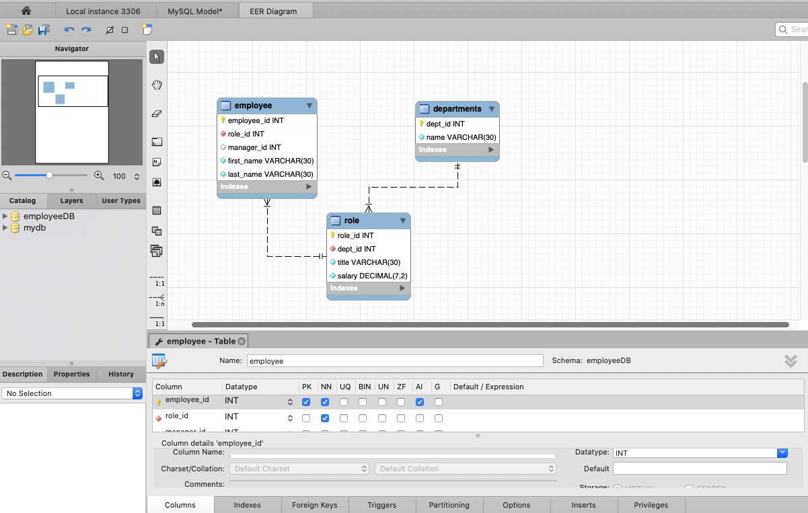
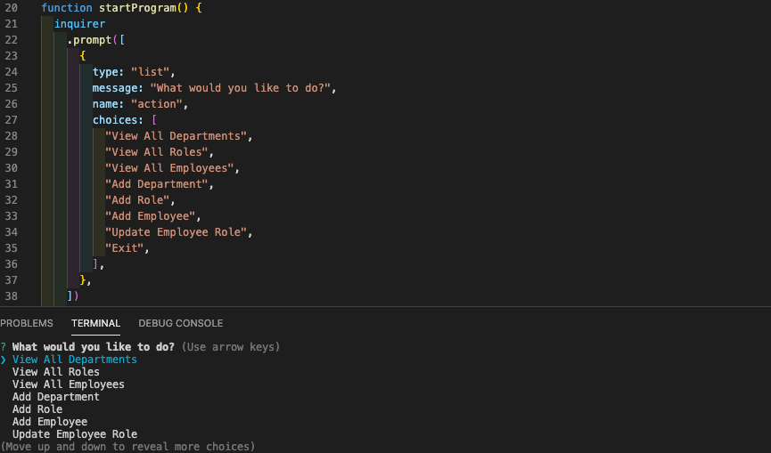
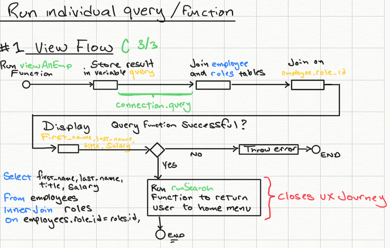
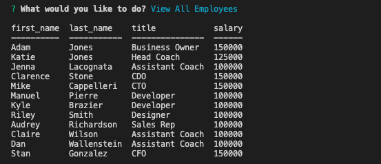

# MySQL Employee Tracker

## Watch video here
UDATED LINK HERE 

## Description
This project is a command-line application that allows the user to add, view, and update employee related information such as department, role, and salary using node, inquirer, and a MySQL database. 

## Table of Contents

- [Description](#description)
- [Installation](#installation)
- [Usage](#usage)
- [Contribution](#contribution)
- [Test](#test)
- [License](#license)
- [Questions](#questions) 
- [Screenshots](#screenshots)

### Installation
Please follow these unique installation instructions (if necessary): Make sure to run npm install and all dependencies including: "expressinquirer" and "mysql"

### Usage
This application’s code is free to use following the terms of the license identified. Additional usage instructions are: Same as license 

### Contribution
This applicating was made by Adam Jones with the assistance of Benjamin Benson (a tutor for the Rutgers Full Stack Coding Bootcamp). 

### Test 
I would not trust my code (or any code) without testing it myself. Please consider performing the following testing on this application prior to use: Take a look to validate that it worked before blindly pushing it to GitHub

### License               
This application is covered under the terms of the Artistic License 2.0 
Pease refer to their site for more details of the terms of use permittable.

### Questions

* If you have any questions or comments regarding this project, please contact me at adam.w.jones2@gmail.com and I will try to reply as soon as possible. 

* If you liked this project, please check out my GitHub page at adamwjones to see more of my work.

### Screenshots

* EER Diagram for initial table creation 

* Inquirer code and command line prompts   

* Ideation sketch on how the query funtionality would work 

* Result of the “View All Employees” query function 

